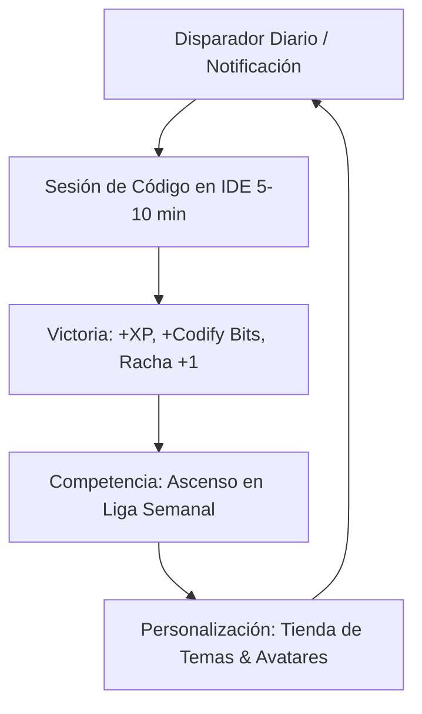

# 🚀 CODIFY: PLAN ESTRATÉGICO DE PRODUCTO, PEDAGOGÍA Y GAMIFICACIÓN
**Auditoría & Visión Arquitectónica para Escalamiento EdTech**  
*Documento de Referencia Estratégica para el Equipo de Desarrollo*

---

## 🎯 1. Visión y Posicionamiento de Mercado

El mercado de la educación tecnológica (*EdTech*) está saturado de cursos en video pasivos donde la tasa de abandono supera el 85%. **Codify** está diseñado para posicionarse en el segmento de **Aprendizaje Activo Gamificado de Alto Rendimiento**, preparando a los estudiantes para los roles más demandados de la industria:
- **Desarrollo Fullstack Moderno (JavaScript/TypeScript + Python)**
- **Arquitectura de Microservicios & APIs con FastAPI**
- **IA Aplicada & LLM Orchestration**

---

## 🧠 2. Pilares Pedagógicos y Aprendizaje Basado en Datos (Data Science)

### A. Estructura Pedagógica de 4 Fases por Lección
Cada micro-desafío debe respetar la regla cognitiva de los 4 pasos:
1. 💡 **Analogía del Mundo Real**: Conectar el concepto abstracto (ej: Promesas, Box Model, Herencia) con un modelo mental tangible.
2. 📝 **Sintaxis Desglosada**: Código comentado, conciso y libre de ruido visual.
3. ⚠️ **Patrones de Error Comunes**: Advertencia preventiva sobre los tropiezos típicos de principiantes.
4. 🎯 **Misión Guiada**: Un objetivo concreto, medible y validable mediante tests automatizados.

### B. Métricas Clave de Rendimiento Educativo (Learning Analytics)
| Métrica | Definición | Objetivo Comercial |
| :--- | :--- | :--- |
| **D1 / D7 / D30 Retention** | % de usuarios activos tras 1, 7 y 30 días del registro | > 60% D1 / > 25% D30 |
| **Lesson Drop-off Rate** | Identificación del punto exacto donde los alumnos se traban | < 5% por desafío |
| **Time-to-Solve (TTS)** | Tiempo medio requerido para resolver cada reto | 3 a 6 minutos |
| **Streak Adherence** | Retención de hábitos diarios de programación | > 40% de la base activa |

---

## 🎮 3. Sistema de Gamificación de Nivel Comercial (*Market-Ready*)

### 1. 🌳 Árbol de Habilidades (Skill Tree RPG)
- Estructura visual no lineal para que el usuario elija su especialización (Frontend, Backend Python, Inteligencia Artificial).
- Desbloqueo de insignias de maestría (*"Async Wizard"*, *"Clean Code Master"*, *"FastAPI Architect"*).

### 2. ⚔️ Duelos de Código en Tiempo Real (PvP Speed Coding)
- Enfrentamientos 1vs1 de 3 minutos donde dos desarrolladores compiten por resolver el mismo desafío.
- Ranking ELO / Matchmaking basado en habilidad real.

### 3. 🏆 Ligas Semanales por Divisiones
- Grupos cerrados de 30 estudiantes con ascensos y descensos semanales (Bronce, Plata, Oro, Diamante, Maestro).

### 4. 💎 Economía Virtual: "La Boutique del Desarrollador"
- Moneda interna: **Codify Bits**.
- Recompensas canjeables:
  - Temas exclusivos de Monaco Editor (Cyberpunk Neon, Dracula Pro, Tokyo Night).
  - Efectos visuales de partículas para el editor al compilar sin errores.
  - *Streak Freezes* para salvar la racha ante emergencias.

---

## 🤖 4. Tutor de IA Socrático Contextual

- **Detección Automática de Frustración**: Si un usuario falla 3 veces consecutivas, el asistente interviene sutilmente.
- **Enfoque Socrático**: Guía al estudiante mediante preguntas conceptuales sin entregar código copiable.
- **Traductor de Errores**: Convierte trazas complejas de errores en explicaciones claras en español.

---

## 🗺️ 5. Hoja de Ruta de Módulos Formativos

- [x] **Módulo 1**: Lógica de Programación & Fundamentos JS (5 lecciones)
- [x] **Módulo 2**: Programación Orientada a Objetos POO - RPG Theme (5 lecciones)
- [x] **Módulo 3**: Prototipado Web Interactivo & DOM Sandbox (10 lecciones)
- [x] **Módulo 4**: Asincronismo & Consumo de APIs (5 lecciones)
- [x] **Módulo 5**: Python Moderno & Backend Fundamentals (5 lecciones)
- [x] **Módulo 6**: FastAPI, Pydantic & APIs Asincrónicas de Alto Rendimiento (10 lecciones)
- [x] **Módulo 7**: IA Aplicada, Embeddings & Integración con LLMs (10 lecciones)
- [x] **Módulo Arena & Speed Coding**: 10 Retos Algorítmicos con Rotación Diaria de 3 Desafíos (Preparado para Duelos PvP)
